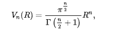
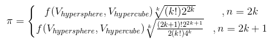

# MonteCarloPi
An admittedly somewhat naive approach to computing PI using a Monte Carlo Simulation with standard python floating point implementation
- This project contains 2 versions of the code located in 
```montecarlopi.py``` and ```nDimensionalMonteCarloPi.py``` respectivly

## File: ```montecarlopi.py```
### Methodology: ```montecarlopi.py```


- Graph generated using [Desmos](https://www.desmos.com/)
### Implementation: ```montecarlopi.py```
- A monte carlo simulation was configured to calculate Pi given a fixed number of iterations and a specified radius for the circle. 
- Calculations were repeated and averaged for each iteration a pre specified number of times
### Results: ```montecarlopi.py```
- The following graph depicts the convergence of the simulations on the value given different values for the radius.
- Data was averaged over 50 redundant redos of the simulations

- The following three graphs are the histogram charts for for the estimated values of pi given the radius. 
- The graphs indicate that the value of Pi lies somewhere between 3.14 and 3.15
- A hand inspection of the data also revealed that the closest estimate the simulation could achieve was 3.141; This method for iterations up to 7k only yielded 3 digits of precision at best. 


## File: ```nDimensionalMonteCarloPi.py```
- Most of the code in this file closely resembles that of ```montecarlopi.py```
### Methodology: ```nDimensionalMonteCarloPi.py```
- For this I realized that the monte carlo method could be applied in higher dimensions ... Instead of selecting points at random within in a square with a circle inscribed (2D), points could be selected at random from a sphere inscribed in a cube (3d); etc.. a hypersphere inscribed in a hypercube for N Dimensions. 
#### Higher Dimensional Volumes
- Of course the notion of area goes to volume goes to a different quantity in higher dimensions however we still refer to this as volume in higher dimensions. 
- The Volume of a N-Ball or a ball in N dimensions (also called a Euclidian Ball) is given by the following formula (image credit [Wikipedia](https://en.wikipedia.org/wiki/Volume_of_an_n-ball))


- In cases where n is a whole number this the gamma function can be simplified leaving a much easier equation to calculate
as we do not have to deal with the integration the gamma function proposes. There are two cases: N is even or N is odd. (image credit [Wikipedia](https://en.wikipedia.org/wiki/Volume_of_an_n-ball))


- The Volume of a Hypercube or a cube in N Dimensions (2D: Square, 3D: Cube ,4D: Tesseract, 5D & on ... Hypercube) has a much nicer looking formula. (image credit [PhysicsInsights](http://www.physicsinsights.org/hypercubes_1.html)) 


#### Construction
- To inscribe a a hypersphere of radius r inside of a hypercube the length of a vertex of the hypercube was set as 2r.


- from the definition of the volume of the hypersphere it followed that for the even case where n could be expressed as the product of some whole number k : n=2k the following is true:


- For the odd case where n = 2k+1 the following was also true


- Now by solving the hypercuve volume equation for 2^k or 2^(k+1) we can achieve the following equation for pi in terms of the volume of the hypersphere and volume of the hypercube:


- Since all terms inside the roots remain positive the functions can be decomposed into the following pieces: a function of the hypervolumes multiplied by a constant for the dimensionality (this suggested an efficient implementation by calculating these rather expensive constants only once)




#### Calculation
- The final step involves approximating the hypervolumes of both. This is accomplished by selecting points from a uniform distribution in the dimension n restricted by the radius: (note! all points will always be in the hypercube)


- To determine whether or not the point is withine the hypercube the squared magnitude of the point vector was calculated and compared with the squared radius of the hypersphere. (Squared terms were compared as to be computationally efficient and avoid a square root where possible) ... If the the magnitude was less then the point was within the hypersphere and the count for the hypersphere volume was incremented


- Pi was finally approximated using the functional expression listed earlier where pi is a function of Dimension as well as the volumes of the hypeshapes. 

### Implementation: ```nDimensionalMonteCarloPi.py```
- A monte carlo simulation was configured to calculate Pi given a fixed number of iterations and a specified radius for the circle. 
- Equations were derived for two cases for N-Dimensions: the case where N is even and the case where N is odd. 
- Calculations were repeated and averaged for each iteration a pre specified number of times
- Repetes were calculated to ensure that the results were *statistically signifigant* 
rloPi.py```
### Results: ```nDimensionalMonteCarloPi.py```
- Monte Carlo simulations were conducted with 10k points per simulation with 100 redos per simulation; Simulations were done in 2D,3D,..., 9D (Dimensions)
- The values of pi at each time step were averaged (within the values associated for the dimension)
- The dashed line is the median value indicated across all values in all dimensions
- The solid line is what was hardcoded into the graph as a *true* value for Pi (3.14159265358979)
- This graph indicates the simulation could approach a decent approximation of pi (however not to any signifigant digit precision as in the case with ```montecarlopi.py```)

